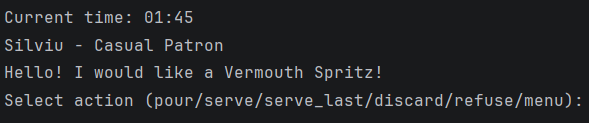
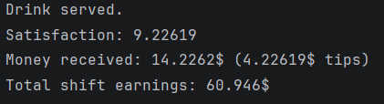
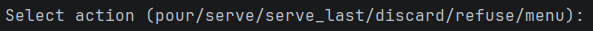

# Bartender Simulator

### C++ OOP Project - FMI Unibuc

## Description

Bartender Simulator is an interactive terminal game, played through text commands.
You are playing the role of a bartender, operating a nightly shift at a busy bar. Customers come up to you and ask for different drinks off the menu. Your job is to follow the recipes as closely as possible and get as many tips as you can by the end of the night.

## Gameplay & Mechanics

Your shift starts at 12AM and ends at 4AM. Every 15 minutes, a customer will come up to the bar with a drink request.

The customer's satisfaction with your concoction will be based on three different criteria: **ingredients used**, **ABV%** and **sweetness**. The purpose is to get these values as close to the menu recipe as possible. Your tip will be calculated based on the client's satisfaction.

### Commands

- **pour**: Start pouring an ingredient into the glass. After typing this command, you will be prompted to input the ingredient name and amount to be poured. Liquids are to be poured in *ml*, while garnishes (like lemon, ice, etc.) are to be poured in *units* and later be converted into ml. Glass capacity is 500ml.
- **serve**: Serve the drink currently in the concoction glass to the customer. You will then receive your payment and another customer will come up to the counter. 
- **serve_last**: Serve the same drink as the one you just served to the last customer. This is useful because customers can ask to have what the last person just had, if it looked good.
- **discard**: Empties the current concoction glass. Useful if you made a mistake and want to start over.
- **refuse**: Refuse service of the current customer. Useful if you don't want to deal with drunk customers or don't feel like preparing a certain drink.
- **menu**: Display all bar drinks and their recipes.
- **exit**: Stop program execution.

### Other Info:
- The same customer can show up multiple times.
- Throughout the night, if a customer is served a lot of alcohol, they can become intoxicated. If a drunk customer is served alcohol, they may do something interesting.
- Customers are of three kinds: casual patrons, heavy drinkers and critics. Each of them has different behaviors and criteria for judging drinks.
- At the end of your shift, you will be prompted to input your name to be added to the leaderboard. There are two leaderboards: one for highest income and one for most successful orders (orders with a satisfaction score above 7.5).